# CS 면접 핵심 이론

# 1. 소프트웨어 공학

> 소프트웨어 공학_기출문제
> 
> 1. 소프트웨어 위기에 대해서 설명하시오.
>    
>    - 답변 point
>      
>      - 정형화된 답보다는 실제 사례
>    
>    - 예시
>      
>      - 2000년대 초반 많은 사람들이 이용했던 싸이울드가 이제는 사용되지 않는 것은 서비스에 대한 다양한 수요를 예측하지 못하고 반영하지 못한 대표적인 사례
>      
>      - 소프트웨어 위기는 소프트웨어가 더 이상 사용자들의 요구를 충족할 수 없어서 사용자로부터 외면받는 것을 이야기함
>    
>    - 소프트웨어 위기란 소프트웨어 공학 초기에 사용되던 용어로 정돈된 주제가 되기 이전에 사용되었다. 이 용어는 급격한 컴퓨터 계산 용량과 문제의 복잡성이 급격히 증가함에 따라 발생한 충격을 서술하기 위해 사용됨. 본질적으로 이는 정확하고 이해할 수 있고, 검증 가능한 컴퓨터 프로그램을 작성하는 것이 얼마나 어려운가를 뜻함
> 
> 2. 소프트웨어 공학이 필요한 이유는 무엇인지 설명하시오.
>    
>    - 답변 point
>      
>      - 소프트웨어공학의 적용에 대해서 예시를 들어 설명
>      
>      - 소프트웨어들 비교
>    
>    - 예시
>      
>      - 소프트웨어공학은 소프트웨어의 개발, 운용, 유지보수 등의 단계를 체계적으로 다루는 학문
>      
>      - @@에서 진행했던 프로젝트에서 단기간에 원하는 목적으로 이루기 위해서 소프트웨어를 기획하고, 설계하고, 구현하고, 테스트하고, 보완하는 과정을 걸쳤는데 이 과정을 체계적으로 정리하고 이를 공유하는 과정이라고 생각한다.
> 
> 3. 소프트웨어 개발 경험과 소프트웨어 개발 시 적용한 개발 방법론이 있다면 설명하시오.
>    
>    - 답변 point
>      
>      - 소프트웨어 개발 경험을 생각해보면 1개 이상의 방법론이 적용됨
>      
>      - 개발 시 고려한 개발방법론이 없더라도 개발했던 경험을 복기해서 가장 적절한 개발방법론을 적용
>    
>    - 예시
>      
>      - 린 개발 방법을 적용했다
>      
>      - 린 개발 방법론의 가장 큰 특징인 낭비요소를 제거하고 지속적인 개선과 수행속도의 향상과 더불어 품질을 효과적으로 개선하는 것인데 @@의 프로젝트가 기간은 짧아 어려움을 겪었다
>      
>      - 초기 서비스에 대한 방향성을 자신할 수 없어서 지속적으로 서비스를 향상할 수 있는 방법론이 필요했고, 그래서 린 개발 방법론을 찾아서 적용하게 되었다.
>      
>      - 경험이 많지 않아서 적용이 쉽지는 않았지만, 단기간에 프로젝트를 완성하는데 도움이 되었다.
> 
> 4. 소프트웨어 프로젝트 진행 경험에 대해서 설명하시오.
>    
>    - 답변 point
>      
>      - 무엇을 보다는 어떻게 개발하였다 가 필요
>      
>      - 개발방법론이나 소프트뤠어 아키텍처를 들어서 설명
>    
>    - 예시
>      
>      - 빅데이터를 통한 관광정보 제공 서비스 개발
>      
>      - 빅데이터를 수집, 분석하여 이용자의 특성에 맞추어 관광정보를 제공하는 서비스 개발
>      
>      - 린 개발 방법론이 @@한 이유에서 짧은 기간 개발에 적용하기 적절하다고 판단하여 적용함.

## 소프트웨어 개발 생명 주기

계획 단계에서 유지보수 단계에 이르기 까지 일어나는 일련의 절차

- 정의 단계 WHAT (계획, 요구 분석)
  
  - 타당성 분석
  
  - 개발 계획
  
  - 요구사항 분석
    
    > - 사용자의 요구사항 확인 및 타당성 검토
    > 
    > - 개발에 필요한 요구사항 명세화

- 개발 단계 HOW (설계, 개발, 테스트)
  
  - 설계
  
  - 개발
  
  - 테스트
    
    > - 코딩을 통한 프로그램 개발
    > 
    > - 단위/통합/시스템/인수/설치 테스트

- 유지보수 단계 CHANGE (적용, 예방, 폐기)
  
  - 유지보수
  
  - 폐기
    
    > - 시스템 운영 및 운영 중 발생한 문제점들에 한 유지 보수
    > 
    > - 새로운 시스템 개발로 인한 기존 시스템 폐기

## 스프트웨어 개발 프로레스 정의

작업순서의 집합 + 제약조건(일정, 예산, 자원)을 포함하는 일련의 행동

- 좁은 의미 : 사용자의 요구사항을 SW로 구현하기 위한 절자, 과정

- 넓은 의미 : 사용자의 목적을 이루기 위한 기획, 프로젝트 관리 등을 포함한 절차, 과정, 방법

- 소프트웨어 개발 7단계 : 계획 > 요구분석 > 설계 > 구현 > 테스트 > 반영 > 유지보수

## 소프트웨어 프로세스 모델

- 에자일 프로세스 모델
  
  - agile : 날렵한, 민첩한
  
  - 고객의 요구에 민첩하게 대응하고 그때그때 주어지는 문제를 풀어나가는 방법론
  
  - 애자일의 기본 가치 : 애자일 선언문
  
  - 프로세스와 도구 중심이 아닌, 상호 소통 중시
  
  - 문서 중심이 아닌, 실행 가능한 소프트웨어 중시
  
  - 계약과 협상이 아닌, 고객과의 협력 중시
  
  - 계획 중심이 아닌, 변화에 대한 민첩한 대응 중시

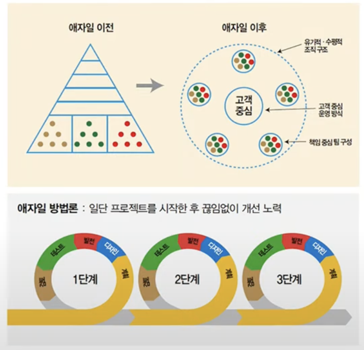

## 소프트웨어 아키텍처 정의

- 정의
  
  - 소프트웨어 대한 전체적인 구조
  
  - 소프트웨어를 이루고 있는 여러 구성(서브시스템, 컴포넌트)
  
  - 구성 요소들의 인터페이스 간의 상호작용 정의
  
  - 시스템 설계와 개발 시 적용되는 원칙과 지침

- 구성
  
  - 구성 요소
  
  - 구성 요소들 사이의 관계
  
  - 구성 요소들이 외부에 드러내는 속성
  
  - 구성 요소들과 주변 환경 사이의 관계
  
  - 구성 요소들이 제공하는 인터페이스
  
  - 구성 요소들의 협력 및 조립 방법

### 아키텍처 모델

- 데이터 중심형 모델
  
  - 주요 데이터가 repository에서 중앙 관리
  
  - repository와 여기에 접근하는 서브시스템으로 구성
  
  - 데이터가 한 군데에 모여있기 때문에 데이터를 모순되지 않고 일관성 있게 관리 가능
  
  - 새로운 서브시스템의 추가 용이
  
  - repository의 병목 현상 발생 가능
  
  - 서브시스템과 repository 사이의 강한 결합 - repository 변경 시 서브시스템에 영향을 줌

- Client-Server 모델
  
  - 네트위크를 이용하는 분산 시스템 형태
  
  - 데이터와 처리 기능을 클라리언트와 서버에 분할하여 사용
  
  - 서버 : 클라이언트(서브시스템)에 서비스 제공
  
  - 클라이언트 : 서버가 제공하는 서비스를 요청(호출)하는 서브시스템

- Layering 모델
  
  - 기능을 몇 개의 계층으로 나누어 배치
  
  - 하위 계층은 서버, 상위 계층은 클라이언트 역할

- Model/View/Controller 모델
  
  - 같은 모델의 서브시스템에 대하여 여러 뷰 서브시스템을 필요로 하는 시스템에 적합
  
  - 장점 
    
    - 데이터를 화면에 표현(view)하는 디자인과 로직(model)을 분리함으로써 느슨한 결합 가능
    
    - 구조 변경 요청 시 수정 용이
  
  - 단점
    
    - 기본 기능 설계로 인한 클래스 수의 증가로 복잡도 증가
    
    - 속도가 중요한 프로젝트에 부적합

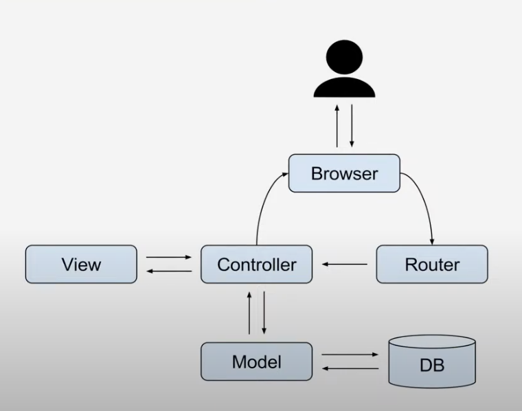

# 2. 프로그래밍

> 기출문제
> 
> - 자바와 c의 차이?
>   
>   - 답변 point
>     
>     - 절차지향 vs 객체지향, 하드웨어 최적화 vs 하드웨어 독립적 등 여러 관점에서 비교
>   
>   - 예시
>     
>     - c는 @@에서 써봤고, 자바는 ##에서 써봤다.
>     
>     - 하드웨어를 제어할 때는 C언어가 적합하다고 생각한다.
>     
>     - 자바를 사용할 때는 다양한 유형의 데이터를 정의와 데이터 간의 관계 설정, 사용자의 동작 정의, 구현하는 과정을 거치는데, 실제 업무와 유사하여 규모 있는 프로젝트를 개발할 때 자바가 적합했던 언어였습니다.
>     
>     - 또한 개발 환경에 있어서도 윈도우 환경에서 개발한 프로그램을 그래도 리눅스 기반으로 알고 있는 안드로이드 환경에서도 &&것을 통해서 하드웨어 독립적으로 운영이 가능한 것이 C언어와 차이이다
> 
> - JVM 가비지컬렉션 동작 과정
>   
>   - 답변 point
>     
>     - 가비지컬렉션은 메모리와 연관됨
>   
>   - 예시
>     
>     - 가비지컬렉션은 JVM에서 메모리를 관리하는 방법으로 더 이상 사용하지 않는 메모리에 대해서 수집해서 스스로 동작해서 사용을 해제하는 기능이다.
>     
>     - C언어를 사용할 때는 코드에서 메모리의 할당과 함께 해제를 같이 처리해주어야 했는데, 자바에서는 직접 해제하는 기능은 없었고, 사용하지 않는 메모리에 대해서는 참조변수에 null을 대입해서, 연결된 메모리가 더 이상 사용하지 않음을 JVM에 알려주는 것만으로 메모리 해제 요청을 하였다.
> 
> - JAVA에 적용된 OOP
>   
>   - 답변 point
>     
>     - 실제 작업한 사례 통해 설명, 설계한 객체와 클래스 비교해 설명
>   
>   - 예시
>     
>     - 서비스에서 제공되는 주요 정보인 관광지/식당/호텔을 객체로 정의
>     
>     - 관광지를 모델링한 것을 객체/ 모델링한 관광지를 자바의 코드로 정의한 것은 클래스
>     
>     - 각 클래스에 실제 관광지 값을 대입하여 메모리에 올린 것은 인스턴스
> 
> - 형상관리 활용 경험 설명 
>   
>   - 예시
>     
>     - 4명 팀원, 프로젝트, 2명은 라이브러리, 1명은 서버, 1명은 사용자 화면 및 동작 개발
>     
>     - SVN 이용해서 형상관리 진행
>     
>     - 업데이트할 때 오류가 있는 코드 업데이터하거나 정확한 코멘트 없어서 힘든 경험
>     
>     - 수시로 베이스라인 변경과 통제를 통해 형상 관리 체계적으로 관리함
> 
> - 리팩토링이란?
>   
>   - 예시
>     
>     - 리팩토링은 결과의 변경 없이 코드의 구조를 재구성하여 가독성을 높이고 유지보수를 편하게 하는데 적용되는 방법이다.
>     
>     - 서로 코드 리뷰하는 시간 가지고 @@하면서 코드를 지속적으로 개선했다

- 컴퓨터 프로그래밍
  
  - 컴퓨터 프로그램
    
    -  어떤 목표를 이루기 위해 컴퓨터에 제시하는 계획
  
  - 코드
    
    - 컴퓨터가 이해하기 쉬운 암호를 작성
  
  - 빌드
    
    - 작성한 코드를 컴퓨터가 이해할 수 있는 형태로 번역하여 작업

- 프로그래밍 언어
  
  - C
  
  > 새로 개발된 유닉스 운영 체제에서 사용하기 위해 개발한 프로그래밍 언어
  > 
  > 유닉스 시스템의 바탕 프로그램은 모두 C로 작성
  > 
  > 수많은 운영 체제의 커널 또한 C로 작성
  
  - C++
  
  > C 언어에 객체지향 프로그램을 지원
  > 
  > 초기에는 C++ 프로그램을 일단 C 프로그램으로 변환하고 나서 C 컴파일러로 컴파일
  > 
  > C언어에 대해 상위 호환성을 갖는 언어
  > 
  > C++ 언어의 표준 규격은 복잡
  
  - Java
  
  > 객체 지향적 프로그래밍 언어
  > 
  > 처음에는 가전제품 내에 탑재해 동작하는 프로그램을 위해 개발
  > 
  > 웹 애플리케이션 개발과 모바일 기기용 소프트웨어 개발에도 널리 사용
  > 
  > 가장 큰 특징은 컴파일된 코드가 플랫폼 독립적
  
  - PHP
  
  > 동적 웹 페이지를 만들기 위해 설계되었으며 이를 구현하기 위해 PHP로 작성된 코드
  > 
  > PHP는 명령 줄 인터페이스 방식의 자체 인터프리터를 제공
  > 
  > 범용 프로그래밍 언어로도 사용
  
  - Python
  
  > 플랫폼 독립적, 인터프리터식, 객체지향적, 동적 타이핑 대화형 언어
  > 
  > 동적 타이핑
  > 
  > 객체의 멤버에 무제한으로 접근(속성이나 전용의 메서드를 만들어 제한 가능)
  > 
  > 모듈, 클래스, 객체와 같은 언어의 요소가 내부에서 접근 가능
  
  - 블록 프로그래밍
  
  > 스크래쳐/엔트리 : 레고처럼 블록을 마우스로 끌어다 연결해가며 프로그램 작성
  > 
  > 앱인벤터 : 안드로이드 기반 어플리케이션 개발

- 데이터분석 언어
  
  - Python
  
  > python은 좀 더 범용적인 범용 개발 언어이고, R은 통계쪽으로 특화된 패키지 많음
  
  - R
  
  > 통계 계산과 그래픽을 위한 프로그래밍 언어이자 소프트웨어 환경
  > 
  > 통계 소프트웨어 개발과 자료 분석에 널리 사용
  > 
  > 패키지 개발이 용이해 통계 소프트웨어 개발
  > 
  > 다양한 통계 기법과 수치 해석 기법을 지원
  > 
  > 그래픽 기능으로 수학 기호를 포함할 수 있는 출판물 수준의 그래프를 제공

- 인공지능 언어
  
  - Python
  
  > Numpy : 텐서연산, Pandas : 데이터프레임
  > 
  > 자연어처리(NLP) - NLTK, Spacy
  > 
  > 머신러닝 - 사이킷런(scikit-learn)
  > 
  > 딥러닝 - 텐서플로우(tensorflow), 파이토치(pytorch), 체이너(chainer), 아파치 MXNet(Apache MXNet), 테아노(Theano)
  
  - 자바
  
  > 자연어 처리(CoreNLP), 텐서 연산(ND4J) 또는 GPU 가속 딥러닝 스택(DL4J)
  
  - C, C++
  
  > CUDA, 텐서플로우, 카페(Caffe), 러스트(Rust)
  
  - 자바스크립트
  
  > Tensorflow.js(구글이 제작한 머신러닝 모델의 학습 및 실행이 가능한 WebGL 가속 라이브러리)
  > 
  > Keras API
  
  - 루아(Lua)
  
  > Torch 프레임워크와 함께 딥러닝 개발에서 가장 인기있는 언어
  
  - 줄리아(Julia)
  
  > 수치 연산에 초점을 둔 고성능 프로그래밍 언어
  > 
  > TensorFlow, Mocha 와 같은 래퍼는 딥러닝을 충실하게 지원
  
  - 텐서플로우용 스위프트(Swift)
  
  > 파이썬이 제공하는 사용의 용이함과 컴파일 언어의 속도 및 정적 형식 확인을 결합하는 것을 목표

## 객체지향

소프트웨어 객체는 현실 세계의 객체를 필드와 메서드로 모델링한 것

소프트웨어 객체는 상태를 필드(Field)로 정의하고, 동작을 메서드(Method)fh 정의

필드는 객체 내부에 **선언된 변수**를 의미하고 메서드는 객체 내부에 **정의된 동작**을 의미함

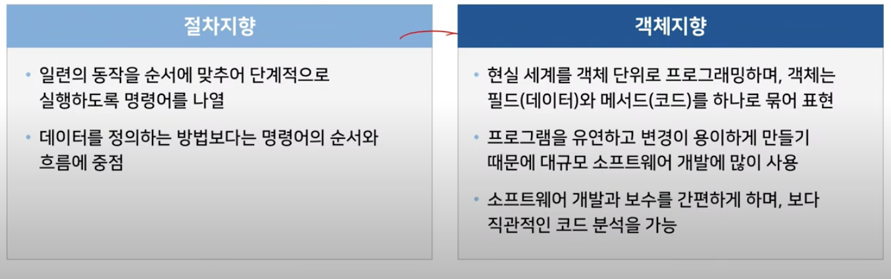

- 주요 개념
  
  - 캡슐화 : 필드와 메서드를 하나의 캡슐처럼 포장해 세부 내용을 외부에서 알 수 없도록 감추는 것
  
  - 상속 : 상위 객체를 상속받은 하위 객체가 상위 객체의 메서드와 필드를 사용하는 것
  
  - 다형성 : 대입되는 객체에 따라서 메서드를 다르게 동작하도록 구현하는 기술, 실행 도중 동일한 이름의 다양한 구현체 중에서 메서드를 선택 가능

## 객체지향 프로그래밍 언어

- Java
  
  - 목적
    
    - Write Once Run Anywhere
    
    - platform independent
    
    - Super computer부터 smart card까지 한번 작성된 코드는 코드의 수정 없이, 코드의 재컴파일 없이 실행 가능
  
  - 개발 목적
    
    - program 개발을 쉽게
    
    - compile 환경이 아니라 interpreted 환경
    
    - 한 개 이상의 thread 사용 가능
    
    - 동적으로 program 변화시킬 수 있음
    
    - code 자체적으로 security 보장

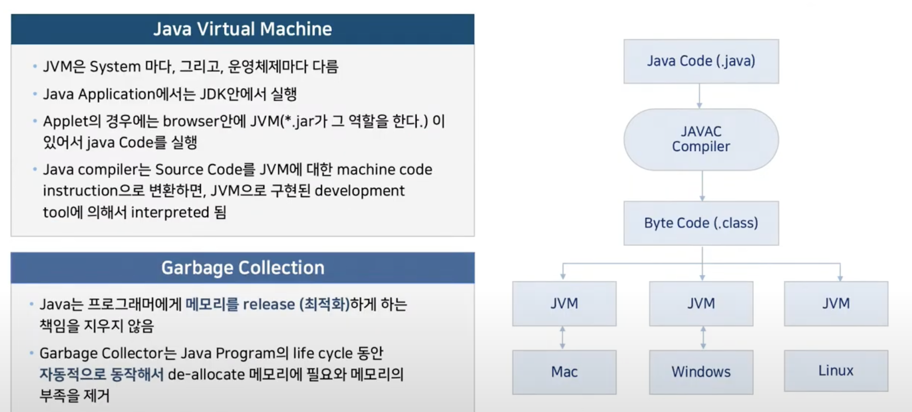

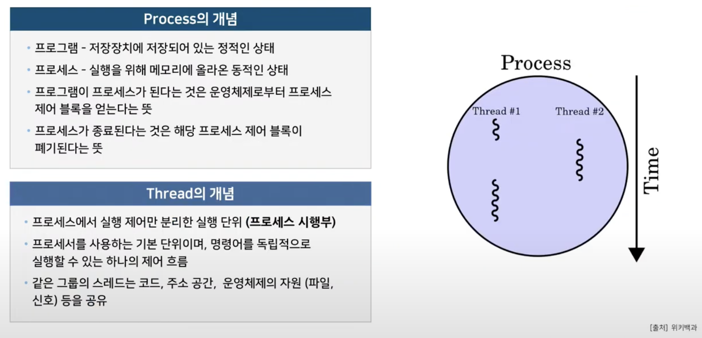

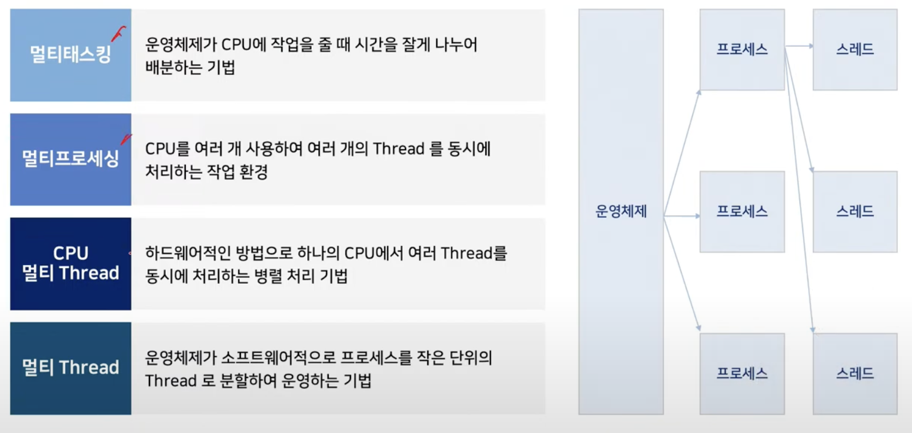

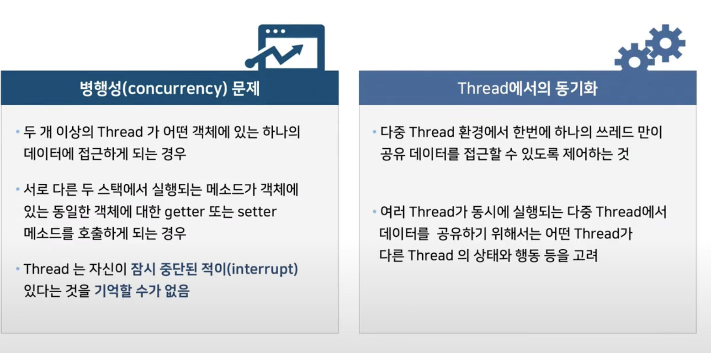

## 형상 관리

- 정의
  
  SW개발 및 유지보수 과정에서 발생하는 변경 사항들을 관리하기 위해 개발된 일련의 활동 (소프트웨어 개발의 전 단계에 적용되는 활동으로, 유지 보수 단계에서 수행)

- 목적
  
  형상 관리는 소프트웨어 개발의 전체 비용을 줄이고, 개발 과정의 여러 방해 요인이 최소화되도록 보증함

- 주요 기능
  
  버전관리, 리버전 관리, 소스 관리, 소스코드 관리
  
  

- 버전 관리 프로그램 종류
  
  - SVN, git, Mercurial, Bazaar 등
  
  

## 빌드 도구

소스코드를 컴파일, 테스트, 정적 분석 등을 실시하여 실행 가능한 애플리케이션으로 자동 생성하는 프로그램(프로젝트를 진행하며 시간이 지남에 따라 라이브러리의 버전을 자동으로 동기화)

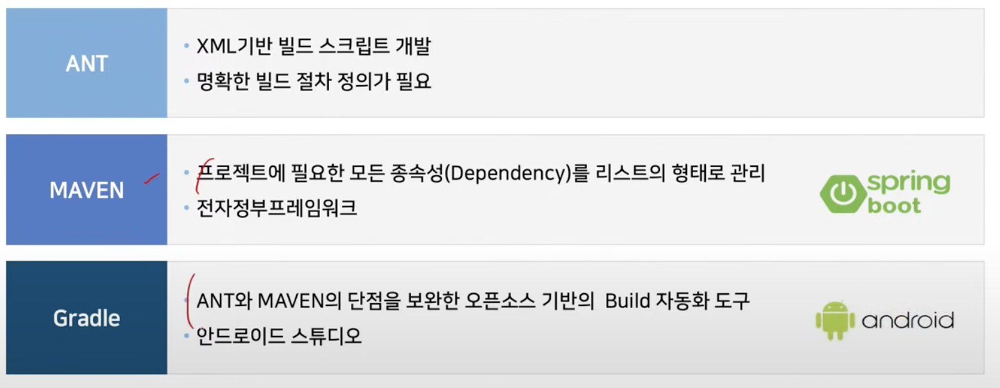

## 프로그래밍 언어_디자인패턴

- 자주 사용하는 설계 형태를 정형화해서 이를 유형별로 설계 템플릿을 만들어둔 것

- 많은 개발자들이 경험상 체득한 설계 지식을 검정하고 이를 추상화하여 일반화한 템플릿

- 클래스 라이브러리 구현시 디자인 패턴이 적용됨

| 장점                  | 단점             |
| ------------------- | -------------- |
| 개발자 간 원활한 의사소통      | 객체 지향 설계/구현 위주 |
| 소프트웨어 구조 파악 용이      | 초기 투자 비용 부담    |
| 재사용을 통한 개발 시간 단축    |                |
| 설계 변경 요청에 대한 유연한 대처 |                |

> - 디자인 패턴은 클래스 라이브러리가 아니다
> 
> - 클래스 라이브러리 구현시, 디자인 패턴이 적용된다
>   
>   - java.util.Calendar 클래스에 getinstance() 메소드에서 Factory Method 패턴이 사용됨
> 
> - 모든 행동 양식에는 패턴이 존재한다
> 
> - OOD에도 패턴이 존재함을 발견 : 23가지 패턴
> 
> - 정의 : S/W 설계 시 반복적으로 나타나는 일련의 규칙을 정의한 것
> 
> - 고급 설계자는 DP를 사용한다. (개발자도 설계자의 의도를 잘 파악해야 함)

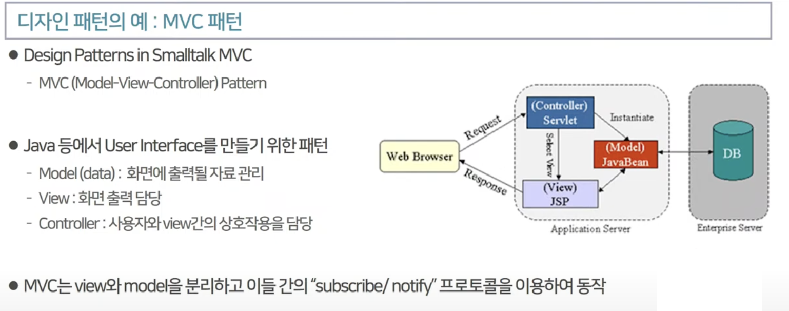

### 디자인 패턴의 3가지 유형

- Creational Pattern
  
  - 객체를 생성하는데 관련된 패턴들
  
  - 객체가 생성되는 과정에서 유연성을 높이고, 코드의 유지가 쉬워진다

- Structural Pattern
  
  - 프로그램의 구조에 관련된 패턴들
  
  - 프로그램 내의 자료구조나 인터페이스 구조 등 프로그램의 구조를 설계하는데 많이 활용될 수 있는 패턴들

- Behavioral Pattern
  
  - 반복적으로 사용되는 객체들의 상호작용을 패턴화 해놓은 것

## 리팩토링

결과의 변경 없이 코드의 구조를 재조정함을 뜻한다.

가독성을 높이고 유지보수를 하여 내부논리나 구조를 바꾸고 개선하는 행위

- 설계 개선
  
  - 요구 변경에 유연한 모델
  
  - 구현 레벨에서의 코드는 유연한 향상

- 나쁜 구조
  
  - 비슷한 코드는 한 곳으로 모든다(클래스 다이어그램 변경)

- Bad smell
  
  - 리팩토링의 시점을 알려주는 지침 중 하나
  
  - 중복된 코드, 너무 긴 메소드, 거대한 클래스, 지나치게 많은 파라미터, 확산적 변경, 변경의 분산, 속성-조작에 욕심, 데이터 덩어리, 기본 데이터 타입에 집착, switch문, 병렬 상속 구조, 게으른 클래스, 지나친 일반화, 임시 속성, 메시지 체인, 미들 맨, 부적절한 친밀성, 다른 인터페이스를 가진 대체 클래스, 미완성 클래스 라이브러리, 데이트 클래스, 상속 거부, 주석 등등

- 리팩토링 방법
  
  - 외부적인 행동은 바꾸지 않는다
  
  - 내부구조를 다듬어 간다
  
  - 작업은 한 스텝씩 진행하고 안전하게 변경을 수행한다.

# 3. 자료구조

자료를 효율적으로 표현하고 저장하고, 처리할 수 있도록 정리하는 것

> 1. stack과 queue의 차이점
>    
>    - 예시
>      
>      - 스택은 바스켓과 같은 형태로 처음에 들어간 것이 나중에 나오는 형태로 데이터를 관리하고, 큐는 파이프와 같은 형태로 처음에 들어간 것이 처음에 나오는 형태로 데이터를 관리한다. 스택은 웹 브라우저에서 페이지 이동 시 페이지 정보를 저장하고 있다가 뒤로가기를 하면 이전 페이지를 불러서 호출하는 것과 같은 방법이고, 큐는 선착순 접수를 구현할 때
> 
> 2. stack, heap을 설명하라

## 순차 자료구조

- 구현할 자료들을 논리적 순서로 메모리에 연속 저장하는 구현 방식

- 논리적인 순서와 물리적인 순서가 항상 일치해야 함

- C프로그래밍에서 순차 자료구조의 구현 방식 제공하는 프로그램 기법은 배열

## 연결 자료구조

- 자료의 논리적이 순서와 물리적인 순서가 불일치
  
  - 각 원소에 저장되어 있는 다음 원소의 주소에 의해 순서가 연결되는 방식
  
  - 물리적인 순서를 맞추기 위한 오버헤드가 발생하지 않음

- 연결리스트 종류
  
  - 연결하는 방식에 다라 단순 연결 리스트와 원형 연결 리스트, 이중 연결
  
  - 리스트, 이중 원형 연결 리스트

| 구분        | 순차 자료 구조                                                    | 연결 자료구조                                                |
| --------- | ----------------------------------------------------------- | ------------------------------------------------------ |
| 메모리 저장 방식 | 메모리의 저장 시작 위치부터 빈자리 없이 자료를 순서대로 연속하여 저장, 논리적 순서와 물리적 순서가 일치 | 메모리에 저장된 물리적 위치가 순서와 상관없이 링크에 의해서 논리적인 순서를 표현하는 구현 방식  |
| 연산 특징     | 삽입, 삭제 연산 후 자료가 순서대로 연속하여 저장, 변경된 논리적 순서와 물리적 순서가 일치        | 삽입, 삭제 연산을 하여 논리적인 순서가 변경되면 링크 정보만 변경되고, 물리적인 순서는 그대로임 |
| 프로그램 기법   | 배열                                                         | 포인터                                                    |

### 선형리스트

### 연결리스트

- 단순 연결 리스트
  
  - 노드가 하나의 링크 필드에 의해서 다음 노드와 연결되는 구조를 가짐
  
  - 연결리스트, 선형 연결 리스트, 단순 연결 선형 리스트

- 원형 연결 리스트
  
  - 단순 연결 리스트에서 마지막 노드가 리스트의 첫 번째 노드를 가리키게 하여 리스트의 구조를 원형으로 만든 연결 리스트
  
  - 단순 연결 리스트의 마지막 노드의 링크 필드에 첫번째 노드의 주소를 저장하여 구성
  
  - 링크를 따라 계속 순회하면 이전 노드에 접근ㄱ ㅏ능

- 이중 연결 리스트
  
  - 양쪽 방향으로 순회할 수 있도록 노드를 연결한 리스트

## 스택

접시를 쌓듯이 자료를 차곡차곡 쌓아 올린 형태의 자료구조

스택에 저장된 원소는 top으로 정한 곳에서만 접근 가능

top의 위치에서만 원소를 삽입하므로, 먼저 삽입한 원소는 밑에 쌓이고, 나중에 삽입한 원소는 위에 쌓이는 구조

후입선출 LIFO (Last-In-First-Out)

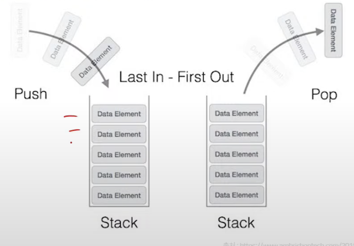

## 큐

스택과 비슷한 삽입과 삭제의 위치가 제한되어 있는 유한 순서 리스트

큐는 뒤에서만 삽입을 하고, 앞에서는 삭제만 할 수 있는 구조

삽입한 순서대로 원소가 나열되어 가장 먼저 삽입한 원소는 맨 앞에 있다가 가장 먼저 삭제됨

선입선출 FIFO (First-In-First-Out)

## 데크(Deque : double-ended queue)

큐 두 개 중 하나를 좌우로 뒤집어서 붙인 구조

큐의 양쪽 끝에서 삽입 연산과 삭제 연산을 수행할 수 있도록 확장한 자료구조

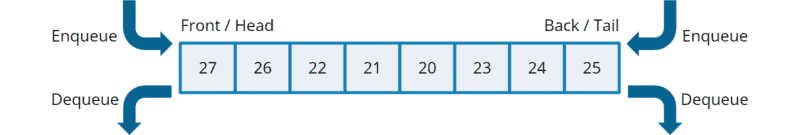

## 트리

- 이진트리
  
  - 트리의 모든 노드의 차수를 2 이하로 제한하여 전체 트리의 차수가 2 이하가 되도록 정의
  
  - 이진 트리의 모든 노드는 왼쪽 자식 노드와 오른쪽 자식 노드만 가짐
  
  - 부모 노드와 자식 노드 수와의 관계 = 1: 2
  
  - 공백 노드도 자식 노드로 취급
  
  - 0 <= 노드의 차수 <= 2

## 그래프

연결되어 있는 원소 사이의 다:다 관계를 표현하는 자료구조

- 그래프 G
  
  - 객체를 나타내는 정점(vertex)과 객체를 연결하는 간선(edge)의 집합
  
  - G = (V, E)
  
  - V는 그래프에 있는 정점들의 집합
  
  - E는 정점을 연결하는 간선들의 집합

# 4. 알고리즘

문제해결 방법을 추상화하여 단계적 절차를 논리적으로 기술해놓은 명세서

- 조건
  
  - 입력 : 알고리즘 수행에 필요한 자료가 외부에서 입력으로 제공
  
  - 출력 : 알고리즘 수행 후 하나 이상의 결과를 출력
  
  - 명확성 : 수행할 작업의 내용과 순서를 나타내는 알고리즘의 명령어들은 명확하게 정의되어야 함
  
  - 유한성 : 알고리즘은 수행 뒤에 반드시 종료
  
  - 효과성 : 알고리즘의 모든 명령어들은 기본적이며 실행이 가능해야 함

- 정렬
  
  - 순서 없이 배열된 자료를 순서대로 재배열
  
  - 키 : 자료를 정렬하는데 사용하는 기준이 되는 특정 값

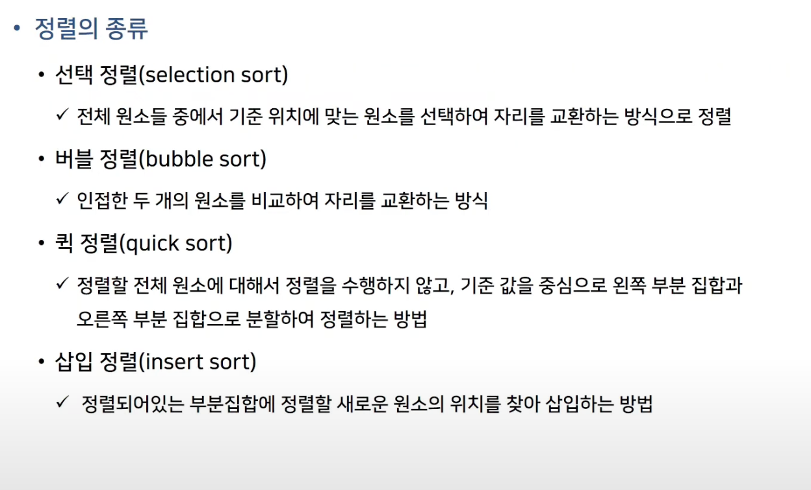

- 검색
  
  - 컴퓨터에 저장한 자료 중에서 원하는 항목을 찾는 작업
  
  - 탐색 키를 가진 항목을 찾는 것

- 탐색 키(search key)
  
  - 자료를 구별하여 인식할 수 있는 키

- 삽입/삭제 작업에서의 검색
  
  - 원소를 삽입하거나 삭제할 위치를 찾기 위해서 검색 연산 수행

- 수행 위치에 따른 분류
  
  - 내부 검색 : 메모리 내의 자료에 대해서 검색 수행
  
  - 외부 검색 : 보조 기억 장치가 있는 자료에 대해서 검색 수행

- 검색 방식에 따른 준류
  
  - 비교 검색 방식 : 검색 대상의 키를 비교하여 검색, 순차검색, 이진검색, 트리 검색
  
  - 계산 검색 방식 : 계수적인 성질을 이용한 계산으로 검색, 해싱

### 검색

- 순차 검색(sequential search), 선형 검색(linear search)
  
  - 일렬로 된 자료를 처음부터 마지막까지 순서대로 검색

- 색인 순차 검색(index sequential search)
  
  - 정렬되어 있는 자료에 대한 인덱스 테이블(index table)을 추가로 사용하여 탐색 효율을 높인 검색 방법

- 이진 검색, 이분 검색, 보간 검색
  
  - 자료의 가운데에 있는 항목을 키 값과 비교하여 다음 검색 위치를 결정하여 검색을 계속하는 방법

- 이진트리 검색
  
  - 이진 탐색 트리를 사용한 검색 방법

- 해싱
  
  - 산술적인 연산을 이용하여 키가 있는 위치를 계산하여 바로 찾아가는 계산 검색 방식
  
  - 키 값에 대하여 해시 함수를 계산하여 주소를 구하고, 구한 주소에 해당하는 해시 테이블로 바로 이동

# 4. 데이터베이스

> 1. View에 대해 설명하시오
> 
> 2. 인덱스에 대해 설명하시오
>    
>    - 답변 point
>      
>      - 사용할 때와 사용하지 않을 때의 결과 비교
>    
>    - 예시
>      
>      - 정보의 수집건수가 만 건 이상이 수집되면서 조회속도와 검색 속도가 많이 늦여졌습니다. 이 부분을 해결하기 위해서 검색의 대상이 되는 필드에 대해서 인덱스를 설정하여 속도를 향상함
> 
> 3. No SQL이 갖는 장점을 설명하시오.
>    
>    - 답변 point
>      
>      - NoSQL은 빅데이터 저장할 때 많이 씀
>      
>      - 관계형 데이터베이스와 비교해서 설명
>    
>    - 예시
>      
>      - NoSQL은 비관계형이기 때문에 정해진 테이블에 하나씩 데이터를 집어 넣어 사용할 수 었으며, 다른 데이터 구조를 가져다 사용할 수도 있기 때문에 대규모의 데이터를 유연하게 처리할 수 있고 설계가 단순하고 데이터의 확장에 유리하다. 또한 대량의 데이터를 무한대로 추가하여 저장할 수 있으며 가변성이 있는 데이터의 저장도 용이하여 결과적으로 유지보수에 적은 비용이 발생

## 데이터의 분류

- 정형 데이터
  
  - 구조화된 데이터, 즉 미리 정해진 구조에 따라 저장된 데이터
  
  - 엑셀 스프레드시트, 데이터베이스 테이블

- 반정형 데이터
  
  - 구조에 따라 저장된 데이터이지만 데이터 내용 안에 구조에 대한 설명이 함께 존재
  
  - 구조를 파악하는 파싱(parsing)과정이 필요
  
  - HTML, XML, JSON 문서나 웹로그, 센서 데이터

- 비정형 데이터
  
  - 정해진 구조 없이 저장된 데이터
  
  - 소셜데이터의 텍스트, 영상, 이미지, 워드, pdf 문서

## 데이터베이스 관리시스템의 정의

- 1세대
  
  - 네트위크 DBMS(그래프 형태), 계층 DBMS(트리 형태)

- 2세대(관계 DBMS)
  
  - 데이터베이스를 테이블 형태로 구성 
  
  - 오라클, MS SQL 서버

- 3세대(객체지향 DBMS, 객체관계 DBMS)
  
  - 객체 지향 DBMS : 객체를 이용해 데이터베이스를 구성
    
    - 오투 O2, 온투스 ONTOS, 젬스톤 GemStone
  
  - 객체관계 DBMS 
    
    - 객체 DBMS + 관계 DBMS

- 4세대
  
  - NoSQL DBMS : 비정형 데이터를 처리하는데 적합하고 확장성이 뛰어남
    
    - 몽고디비(MongoDB), 카산드라(Cassandra)
  
  - NewSQL DBMS : 관계 DBMS의 장점 + NoSQL의 확장성 및 유연성
    
    - 구글 스패너(Spanner), 볼트DB(VoltDB)

## 데이터베이스 용어

- 스키마
  
  - 데이터베이스에 저장되는 데이터 구조아 제약조건을 정의한 것

- 인스턴스
  
  - 스키마에 따라 데이터베이스에 실제로 저장된 값

- 데이터 독립성
  
  - 하위 스키마를 변경하더라도 상위 스키마가 영향을 받지 않는 특성
  
  - 논리적 데이터 독립성 - 개념 스키마가 변경되어도 외부 스키마는 영향을 받지 않음
  
  - 물리적 데이터 독립성 - 내부 스키마가 변경되어도 개념 스키마는 영향을 받지 않음

### View

- 관계 데이터베이스의 데이터베이스 언어 SQL에서 하나 이상의 테이블 (또는 다른 뷰)에서 원하는 모든 데이터를 선택하여, 그들을 사용자 정의하여 나타낸 것

- 데이터를 실제로 저장하지 않고 논리적으로만 존재하는 테이블이지만, 일반 테이블과 동일한 방법으로 사용함

### Index

- 데이터베이스 분야에 있어서 테이블에 대한 동작의 속도를 높여주는 자료 구조

- 인덱스는 테이블 내의 1개의 컬럼, 혹은 여러개의 컬럼을 이용하여 생성

- 고속의 검색 동작 뿐만 아니라 레코드 접근과 관련한 효율적인 순서 매김 동작에 대한 기초를 제공

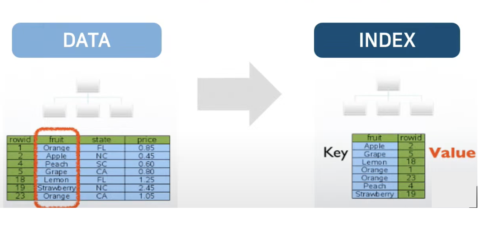

### 관계 데이터 모델 키(key)

- 릴레이션에서 튜플들을 유일하게 구별하는 속성 또는 속성들의 집합

- 키의 특성
  
  - 유일성 : 하나의 릴레이션에서 모든 튜플은 서로 다른 키 값을 가져야 함
  
  - 최소성 : 꼭 필요한 최소한의 속성들로만 키을 구성함

- 키의 종류
  
  - 슈퍼키 : 유일성을 만족  ex) 고객아이디, (고객아이디, 고객 이름)
  
  - 후보키 : 유일성과 최소성을 만족 ex) 고객아이디,  (고객이름, 고객아이디)
  
  - 기본기 : 후보키 중에서 기본적으로 사용하기 위해 선택한 키 ex) 고객아이디
  
  - 대체키 : 기본키로 선택되지 못한 후보키
  
  - 외래키 : 다른 릴레이션의 기본키를 참조

### 제약조건

- 무결성 제약 조건(integrity constraint)
  
  - 데이터의 무결성을 보장하고 일관된 상태로 유지하기 위한 규칙
  
  - 무결성 : 데이터를 결험이 없는 상태, 즉 정확하고 유효하게 유지하는 것

- 개체 무결성 제약조건(entity integrity constraints)
  
  - 기본키를 구성하는 모든 속성은 널 값을 가질 수 없는 규칙

- 참조 무결성 제약조건(referential integrity constraint)
  
  - 외래키는 참조할 수 없는 값을 가질 수 없는 규칙

## 데이터 모델링

- 현실 세계에 존재하는 데이터를 컴퓨터 세계의 데이터베이스로 옮기는 변환 과정

- 데이터베이스 설계의 핵심 과정

#### 2단계 데이터 모델링

- 개념적 데이터 모델링(conceptual modeling)
  
  - 현실 세계의 중요 데이터를 추출하여 개념 세계로 옮기는 작업

- 논리적 데이터 모델링(logical modeling)
  
  - 개념 세계의 데이터를 데이터베이스에 저장하는 구조로 표현하는 작업

### 개체-관계 모델

- E-R model, Entity-Relationship model

- 개체와 개체 간의 관계를 이용해 현실 세계를 개념적 구조로 표현
  
  - 개체-관계 다이어그램(E-R diagram)
    
    - 개체-관계 모델을 이용해 현실 세계를 개념적으로 모델링한 결과물

### 관계데이터모델

- 개념적 구조를 논리적 구조로 표현하는 논리적 데이터 모델

- 하나의 개체에 대한 데이터를 하나의 릴레이션에 저장

### 데이터베이스의 구성

- 데이터베이스 스키마(database schema)
  
  - 데이터베이스의 전체 구조
  
  - 데이터베이스를 구성하는 릴레이션 스키마의 모음

- 데이터베이스 인스턴스(database instance)
  
  - 데이터베이스를 구성하는 릴레이션 인스턴스의 모음

## 데이터베이스_정규화

- 이상 현상(anomaly)
  
  - 불필요한 데이터 중복으로 인해 릴레이션에 대한 데이터 삽입, 수정, 삭제 연산을 수행할 때 발생할 수 있는 부작용
  1. 삽입 이상 : 릴레이션에 새 데이터를 삽입하려면 불필요한 데이터도 함께 삽입해야 하는 문제
  
  2. 갱신 이상 : 릴레이션의 중복된 튜플들 중 일부만 수정하여 데이터가 불일치하게 되는 모순이 발생하는 문제
  
  3. 삭제 이상 : 릴레이션에서 튜플을 삭제하면 꼭 필요한 데이터까지 손실되는 연쇄 삭제 현상 발생 문제

- 정규화
  
  - 이상 현상을 제거하면서 데이터베이스를 올바르게 설계해 나가는 과정
  
  - 함수적 종속성을 이용해 릴레이션을 연관성이 있는 속성들로만 구성되도록 분해해서 이상 현성이 발생하지 않는 바람직한 릴레이션으로 만들어 가는 과정
  
  - 정규화를 통해 릴레이션은 무손실 분해(nonloss decompostiion)되어야 함

- 함수적 종속성(FD : Functional Dependency)
  
  - 속성들 간의 관련성
  
  - 함수 종속성을 이용하여, 릴레이션을 연관성이 있는 속성들로만 구성되도록 분해햐여 이상 현상이 발생하지 않는 바람직한 릴레이션으로 만들어야 함

- 정규형
  
  - 릴레이션이 정규화된 정도로 각 정규형마다 제약조건이 존재
  
  - 릴레이션의 특성을 고려하여 적합한 정규형을 선택

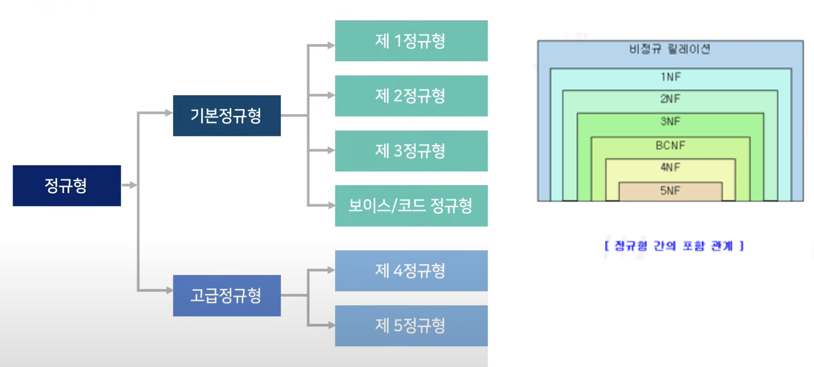

## No SQL

| 구분     | 빅데이터 이전의 데이터                    | 빅데이터                                        |
| ------ | ------------------------------- | ------------------------------------------- |
| 데이터 유형 | 정형화된 문자, 수치 데이터 중심              | 정형, 반정형, 비정형 데이터 모두 포함                      |
| 관련 기술  | 관계 데이터베이스                       | 저장기술 : 하둡, NoSQL                            |
|        | SAS, SPSS 같은 통계 패키지             | 분석 기술 : 텍스트마이닝, 오피니언 마이닝, 소셜 네트워크 분석, 군집 분석 |
|        | 데이터 마이닝, 기계학습                   | 표현 기술 : R언어                                 |
| 저장 장치  | 데이터베이스나 데이터 웨어하우스와 같은 고가의 저장 장치 | 비용이 저렴한 클라우드 컴퓨팅 장비 활용 가능                   |

- 등장 배경
  
  - 관계 데이터베이스를 대신할 새로운 대안의 필요성
    
    - 정형화된 데이터를 주로 처리하는 관계 데이터베이스
      
      빠른 속도로 대량 생상되는 다양한 유형의 비정형 데이터를 저장 및 관리하는데 적합하지 않음
    
    - 단일 컴퓨터 환경에서 주로 사용되는 데이터베이스
      
      여러 컴퓨터가 연결되어 하나의 시스템을 구성하는 클러스터 환경에는 확장성 측면에서 비효율적임
  
  - 새로운 대안으로 NoSQL 등장
    
    - 관계 데이터베이스만 고집하지 말고 필요에 따라 다른 특성을 제공하는 데이터베이스를 사용하는 것이 좋다는 의미로 이해

- 의미
  
  빠른 속도로 생성되는 대량의 비정형 데이터를 저장하고 처리하기 위해 ACID(원자성, 일관성, 격리성, 지속성)를 위한 트랜잭션 기능을 제공하지 않는 대신 저렴한 비용으로 여러 대의 데이터를 분산, 저장, 처리하는 것이 가능한 데이터베이스

- 특징
  
  - 관계 모델보다 더 융통성 있는 데이터 모델 사용
  
  - 스키마 없이 동작하기 때문에 데이터 구조를 미리 정의할 필요가 없고 수시로 그 구조를 바꿀 수 있어 비정형 데이터를 저장하기 적합
  
  - 대부분 오픈소스

| ㅎ   | 관계 데이터베이스                                                   | NoSQL                                                                |
| --- | ----------------------------------------------------------- | -------------------------------------------------------------------- |
| 장점  | 트랜잭션을 통해 일관성을 유지하고, 외래키로 테이블 간의 관계를 표현함으로써 조인과 같은 복잡한 처리 가능 | 트랜잭션 기능을 제공하지 않고 정해진 스키마도 없기 때문에 자유롭게 구조를 바꾸며 대량의 비정형 데이터를 빠르게 처리 가능 |
| 단점  | 빠른 속도로 증가하는 대량의 비정형 데이터를 저장하는데 확장성 측면에서 비효율적                | SQL 대신 별도의 분석 기술을 이용해 데이터 속에 숨겨진 의미를 찾아내야 함                          |

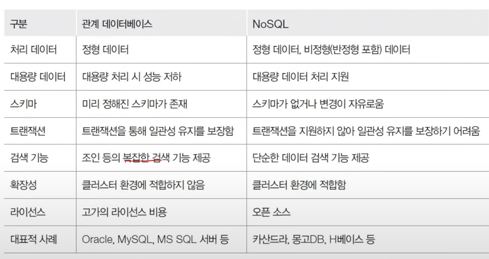

- 저장될 데이터의 형태와 처리 목적에 더 적합한 것 선택
  
  - 기업의 인사, 회계 자료와 같이 일관성 중요, 복잡한 질의처리 필요한 정형화된 데이터 관라 = 관계 데이터베이스
  
  - SNS 이미지, 텍스트, CCTV 촬영 영상, 센싱 데이터 같이 빠른 속도로 엄청난 양 생성되니잠 수정보다는 삽입 연산 위주의 데이터 저장하고 관리 = NoSQL

## 데이터엔지니어링

- 과정
  
  - 데이터소스 > 수집 > 저장 > 처리 > 분석 > 표현

### 빅데이터 소스 생성과 수집 기술

- 내부 데이터 수집
  
  - 자체적으로 보유한 내부 파일 시스템, 데이터베이스 관리 시스템, 센서 등에서 정령 데이터 수집

- 외부 데이터 수집
  
  - 인터넷으로 외부에서 비정형 데이터 수집
  
  - 로그 수집기
  
  - 크롤링

### 빅데이터 저장 기술

- 분산파일 시스템
  
  - 컴퓨터 네트워크로 공유하는 여러 호스트 컴퓨터 파일에 접근할 수 있는 파일 시스템
  
  - GFS, HDFS, Amazon S3

- NoSQL
  
  - 데이터 모델을 단순화해서 관계형 데이터 모델과 SQL을 사용하지 않는 모든 DBMS 또는 데이터 저장 장치
  
  - Cloudata, Hbase, Cassandra

- 병렬 DBMS
  
  - 다수의 마이크로프로세서를 사용하여 여러 디스크의 질의, 갱신, 입출력 등 데이터베이스 처리를 동시에 수행
  
  - VoltDB, SAP HANA, Vertica

- 네트워크 구성 저장 시스템
  
  - 서로 다른 종류의 데이터 저장장치를 하나의 데이터 서버에 연결하에 관리
  
  - SAN, NAS

### 빅데이터 처리 기술

- 맵리듀스
  
  - 구글에서 대용량 데이터 처리를 분산 병렬 컴퓨팅에서 처리하기 위한 목적으로 제작하여 2004년 발표한 소프트웨어 프레임워크

- R
  
  - 다양한 통계 기법과 수치 해석 기법을 지원하고, 그래픽 기능으로 수학 기호를 포함할 수 있는 출판물 수준의 그래프 제공

- 하둡
  
  - 정형, 비정형 빅데이터 분석에 가장 선호되는 솔루션

- NoSQL

### 빅데이터 분석 기술

- 텍스트 마이닝
  
  - 비정형 텍스트, 정보추출 또는 데이터 간의 연계성 파악

- 웹 마이닝
  
  - 인터넷에서 수집한 정보, 데이터 마이닝 기법으로 분석

- 오피니언 마이닝
  
  - 온라인 뉴스, 소셜미디어 코멘트, 사용자의 의견 추출, 감성 분석, 버즈 분석

- 리얼리티 마이닝
  
  - 휴대폰 기기 이용(통화량, 통화위치, 통화상태, 대상, 내용), 인간관계와 행동양태 등 추론

- 소셜 네트워크 분석
  
  - 그래프 이론, 소셜 네트워크 연결 구조와 연결 강도 분석, 사용자의 명성 또는 영향력 측정

- 분류
  
  - 새로 추가되는 데이터가 속할 데이터군을 찾는 지도학습방법, KNN

 

# 4. 컴퓨터 시스템

- 폰노이만 구조
  
  - CPU, 메모리, 입출력장치, 저장장치가 버스로 연결되어 있는 구조
  
  - 프로그램은 하드디스크와 같은 저장 장치에 담겨 있으나,
  
  - 폰노이먼 구조의 가장 큰 특징은 저장장치에서 바로 실행할 수 없고 메모리로 가지고 올라와야 실행이 가능함
    
    - 메모리 관리가 중요한 이슈

## 컴퓨터 시스템 구성요소

- 프로세서
  
  - 운영체제와 가장 밀접한 하드웨어로 각 부분의 동작 제어 및 연산 수행

- 버스
  
  - 프로세서를 포함한 각 장치 간 또는 서브시스템을 서로 연결하여 정보(데이터)를 주고받을 수 있게 해주는 통로

- 레지스터
  
  - 프로세서에 위치한 고속 메모리로 프로세서가 바로 사용할 수 있는 데이터 저장

- 메모리
  
  - 메모리 계층 구조는 1950~1960년대 메인 메모리의 높은 가격으로 인해 제안된 방법으로, 다양한 레벨의 메모리를 연결하여 비용, 속도, 용량, 접근 시간 등을 상호 보완

- 주변 장치
  
  - 컴퓨터의 기능을 향상시키기 위한 추가 장비

## 운영체제 아키텍쳐

- 모놀리식 커널
  
  - 모든 컴포넌트 커널에 포함
  
  - 호출 기능만으로 다른 구성 요소와 통신 가능
  
  - 컴퓨터 시스템에 제한 없이 접근
  
  - 높은 성능
  
  - 오류나 악성 코드에 취약

- 마이크로커널
  
  - 소수의 서비스만 제공
  
  - 커널 규모 감소, 규모 확장성 향상
  
  - 구성 요소를 낮은 수준의 권한으로 커널 외부에서 실행
  
  - 확장성, 이식성, 규모 확장성 향상
  
  - 모듈 간 통신이 많아 성능 감소 우려

# 5. 네트워크
